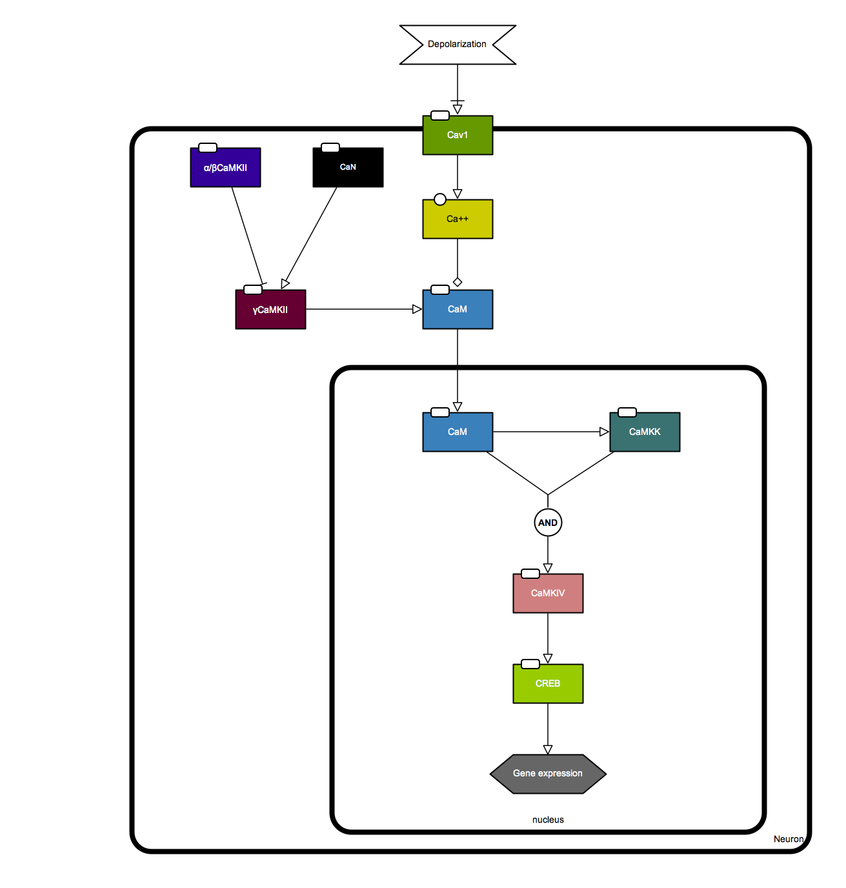

This page provides SBGN diagrams from the following paper published in the October, 2014 issue of the Cell magazine (PubMed ID: [25303525](http://www.ncbi.nlm.nih.gov/pubmed/25303525)).

*Ma H, Groth RD, Cohen SM, Emery JF, Li B, Hoedt E, Zhang G, Neubert TA, Tsien RW. (2014) γCaMKII shuttles Ca²⁺/CaM to the nucleus to trigger CREB phosphorylation and gene expression. [Cell 159,281-294](http://www.sciencedirect.com/science/article/pii/S0092867414011684).*

### Summary of the diagram

Activity-dependent CREB phosphorylation and gene expression are critical for long-term neuronal plasticity. Local signaling at CaV1 channels triggers these events, but how information is relayed onward to the nucleus remains unclear. Here, we report a mechanism that mediates long-distance communication within cells: a shuttle that transports Ca(2+)/calmodulin from the surface membrane to the nucleus. We show that the shuttle protein is γCaMKII, its phosphorylation at Thr287 by βCaMKII protects the Ca(2+)/CaM signal, and CaN triggers its nuclear translocation. Both βCaMKII and CaN act in close proximity to CaV1 channels, supporting their dominance, whereas γCaMKII operates as a carrier, not as a kinase. Upon arrival within the nucleus, Ca(2+)/CaM activates CaMKK and its substrate CaMKIV, the CREB kinase. This mechanism resolves long-standing puzzles about CaM/CaMK-dependent signaling to the nucleus. The significance of the mechanism is emphasized by dysregulation of CaV1, γCaMKII, βCaMKII, and CaN in multiple neuropsychiatric disorders.

**SBGN-PD** and **AF** maps were created based on [Graphical Abstract](http://www.sciencedirect.com/science/article/pii/S0092867414011684#fx1) of the paper. [SBGN-ED](http://www.sbgn-ed.org/), an SBGN editing software, was used to draw the diagram.

Below is the SBGN-PD map of the pathway. 
{: .center-image }

Here is the SBGN-AF map pf the pathway.
{: .center-image }

### Additional downloads

[SBGN-ML format for PD map](https://raw.githubusercontent.com/sbgn/pathway-archive/master/camkii-creb-phosphorylation/POM_Nov2014_PD.sbgn)

[SBGN-ML format for AF map](https://raw.githubusercontent.com/sbgn/pathway-archive/master/camkii-creb-phosphorylation/POM_Nov2014_AF.sbgn)

### Archives

Click [here](https://github.com/sbgn/pathway-archive) to access all pathways in the repository.
